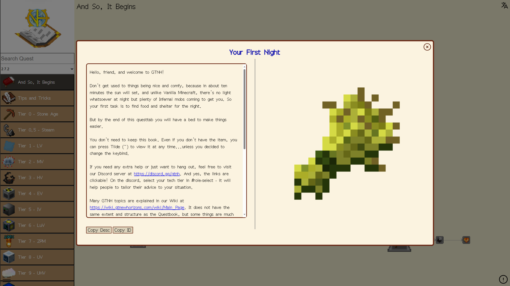

# Quest Book for Anything/在线任务书
## By Harogenshi  

### 修改自：Better Online QuestBook/更好的在线任务书
原作者：MCTBL & Grievous_Rain_  
链接：https://github.com/MCTBL/Better_Online_QuestBook  

<!--   -->

一时间想不起是哪个任务但又不方便开游戏?试试这个,更好的在线任务书!
### 版权声明
已遵守MIT协议添加原协议书，原版权归MCTBL & Grievous_Rain_所有  
**修改的代码部分**版权属于Harogenshi，同样遵循MIT协议。

## How to use locally/本地使用方式

#### 初始化

*PNPM*: 根目录下执行`pnpm i`

*NPM*: 根目录下执行`npm i`

#### 构建

*PNPM*：根目录`pnpm run build`

*NPM*：根目录`npm run build`

#### 开发

*PNPM*：根目录`pnpm run start`

*NPM*：根目录`npm run start`

tips:

不需要服务器可以使用watch

*PNPM*：根目录`pnpm run watch`

*NPM*：根目录`npm run watch`

如果需要开启vconsole，可以在url后面添加`?log=1`get参数

